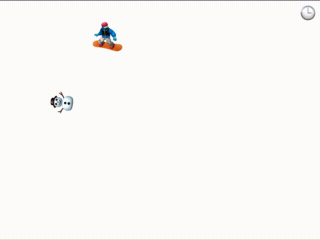

# Snowboard Emojedition 🏂

A endless runner snowboard game implemented with [purescript](https://github.com/purescript/purescript) and the [emo8 engine](https://github.com/opyapeus/purescript-emo8).

Everything to learning and practice 🧐.

## Game 🕹

You can play the game in [snowboard-emojedition.netlify.app](snowboard-emojedition.netlify.app).

<p align="center">
    
</p>

## Build / Development 🤓

1. Clone the project and install dependencies

```sh
git clone https://github.com/MarioMatheus/snowboard-emojedition.git
cd snowboard-emojedition
npm install
```

2. Build and run project

```sh
spago build
npm run dev
```

3. Go to http://localhost:1234
